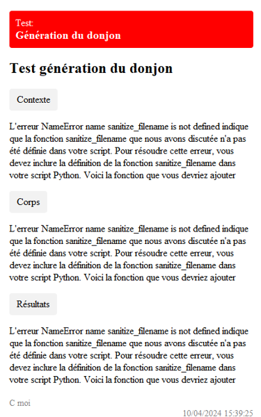
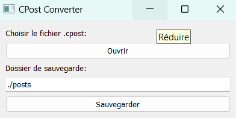

# CPOST documentation

## Introduction

### Contexte

Cpost est une application qui permet de convertir des fichiers au format .cpost en post HTML / PNG.
Ce projet a vu le jour dans des contexte de gestion de projet où il était nécessaire de partager des informations de manière simple et rapide.
Vous apprendrez ici comment installer, utiliser et comprendre Cpost.



### Auteurs

Nathan Fourny | Développement ; Rédaction de la documentation

### Documentation Hors Ligne

Vous pourrez retrouver le pdf de la documentation hors ligne ici : [Documentation Hors Ligne]()

## Téléchargement

### Dépendances

Pour pouvoir utiliser et faire fonctionner Cpost vous aurez besoin des outils suivant :  

- Téléchargez [wkhtmltoimage](https://wkhtmltopdf.org/downloads.html)
- Assurez vous d'ajouter la variable d'environnement de wkhtmltoimage à votre PATH

### Windows

Pour utiliser Cpost, rendez-vous sur le [github](https://github.com/NeekzenTutorials/cposts-postcard-generator) du projet et téléchargez le projet zip de la branch main.  

Décompressez le .zip dans un dossier de votre choix.  

Ouvrez un terminal dans le dossier du projet et exécutez la commande suivante pour installer toutes les dépendances:  

```bash
pip install -r requirements.txt
```

Vous pouvez désormais exécuter le script transpileur.py.

### Linux

À définir

### MacOS

À définir

### Extension .cpost sur VSCode

Pour faciliter l'édition des fichiers .cpost, vous pouvez installer l'extension [.cpost](https://marketplace.visualstudio.com/items?itemName=Csquare.cpost) sur Visual Studio Code.

L'extension est aussi disponible depuis l'onglet **Extension** directement sur Visual Studio Code.

## Utilisation

### Créer un fichier .cpost

Pour créer un fichier .cpost, il vous suffit de créer un fichier texte et de le nommer avec l'extension .cpost.

**Remarque: Il est conseillé d'utiliser le bloc note ou une IDE comme Visual Studio Code**

### Syntaxe

La syntaxe des fichiers .cpost est très simple. Voici un exemple de fichier .cpost :

```cpost
type: test
#type: fix
#type: post


titre: Titre du post


objet: Objet du post


contexte: Contexte du post


corps: Corps du post


resultats: Résultats du post


auteur: Auteur(s) du post
```

**Remarque: Vous pouvez retrouver un template.cpost dans le [github](https://github.com/NeekzenTutorials/cposts-postcard-generator) du projet**


### Convertir un fichier .cpost

Pour convertir un fichier .cpost en post HTML / PNG, il vous suffit d'exécuter le script transpileur.py.  
Une fois lancé une petite application va apparaître. Vous pourrez sélectionner le fichier .cpost que vous souhaitez convertir.



Une fois sélectionné vous pouvez choisir le dossier de sauvegarde du post. Par défaut il crée un dossier "posts" dans le dossier du projet.  
Vous pouvez finalement cliquer sur le bouton "Sauvegarder" pour générer le post.


