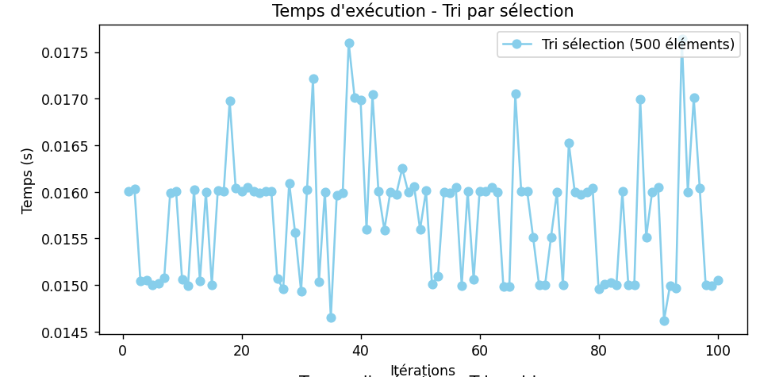
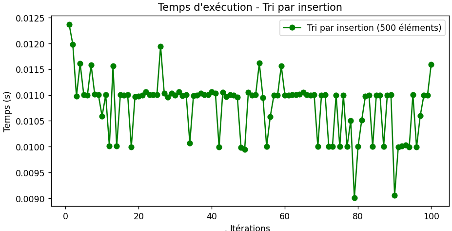
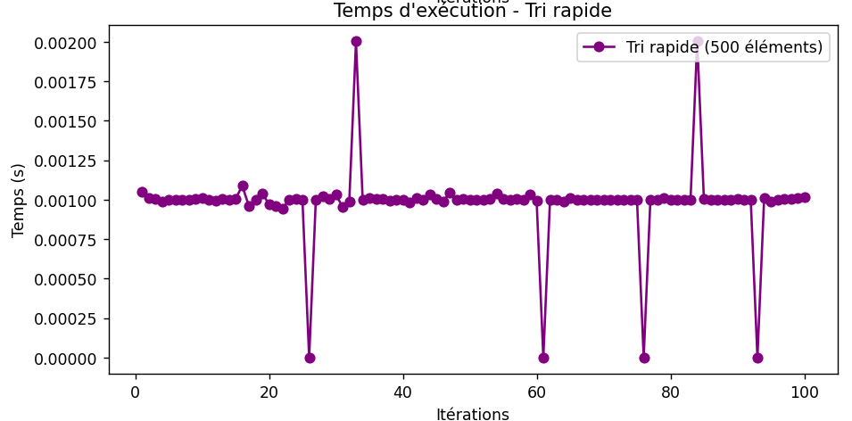
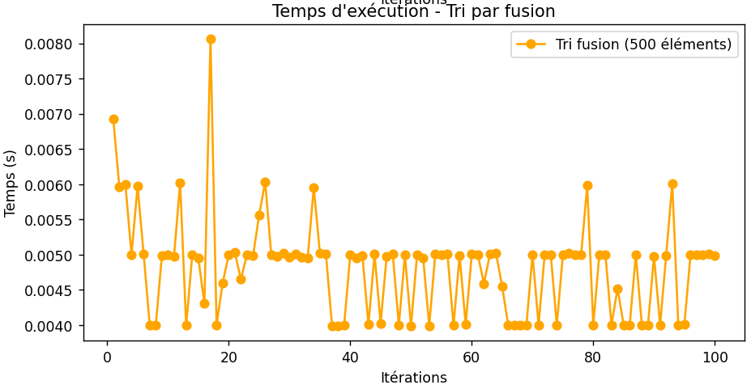
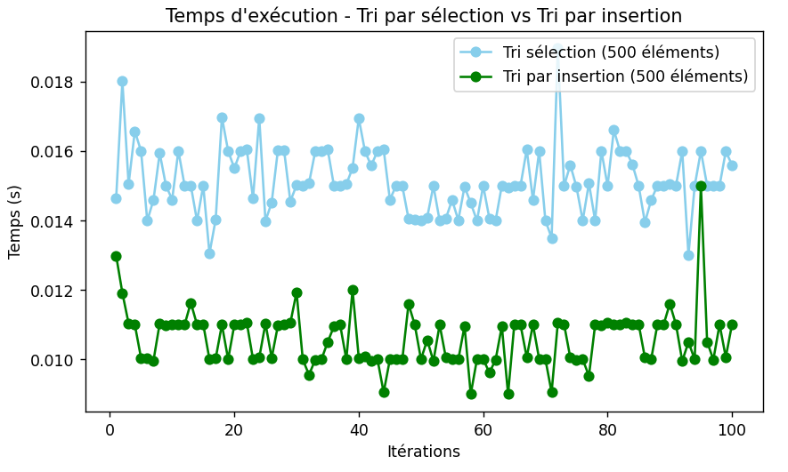
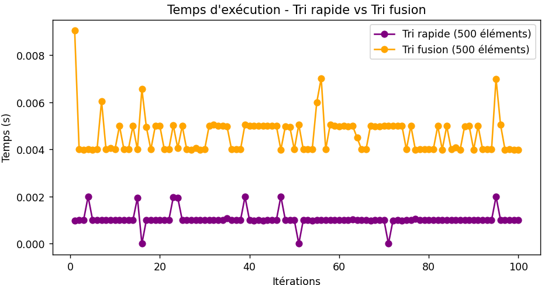
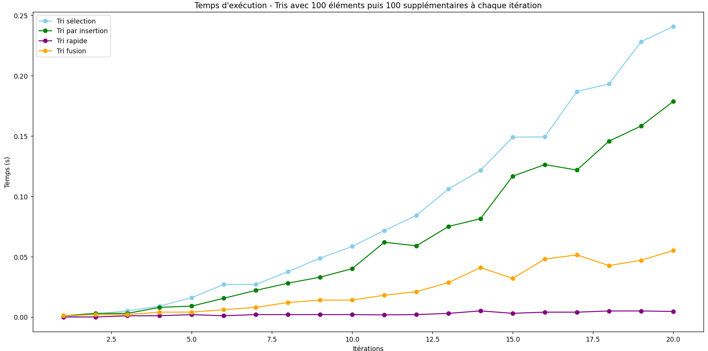

## Préambule

### Auteur

- Fourny Nathan : Étudiant | Rédacteur du rapport d'analyse

### Contexte

Ce projet a été réalisé dans le cadre du module "Qualité Algorithmique | R5.04" du BUT informatique 3e Année.

### Objectif

L'objectif de ce projet est d'analyser les performances des algorithmes de tri en Python. Pour cela, nous avons implémenté les algorithmes de tri suivants :
- Tri par sélection
- Tri par insertion
- Tri rapide
- Tri fusion

Chaque tri ont été testé 100 fois sur des liste de 500 éléments allant de -100 à 100.

## Analyse

### Exécution primaire

* Tri par sélection

On remarque ici que l'exécution du tri par sélection est assez chaotique. On aperçoit de grande variation avec une médiane d'exécution à environ 0.0160s. 

* Tri par insertion

Le tri par insertion est plus stable que le tri par sélection. Cependant on remarque que sa première exécution est plus lente que les suivantes. En effet sa première exécution dure environ 0.0125s alors qu'on peut situer sa médiane à environ 0.0110s.  
On remarque également que vers le dernier tier des itérations, le temps d'execution devient de plus en plus court.

* Tri rapide

Dès le premier coup d'oeil on remarque que le tri rapide semble beaucoup plus rapide, performant et stable que les deux précédents.  
Dans la quasi majorité des itérations on voit que le temps d'exécution est stable vers 0.001s.  
Il est également très intéréssant de noter que certaines itérations sont très rapides et estimé à 0s d'exécution. soit instantané. Tandis que d'autres sont nettement plus longues que les autres. Cela peut être dû au changement de pivot que peut être mal fait ce qui fait que l'algorithme passe d'une complexité O(n log n) à O(n^2) dans le pire des cas.

* Tri fusion

Le tri fusion est également très différents des autres. On remarque que le premiers tier d'exécution de l'algorithme est beaucoup plus lent et instable que les deux autres tiers.  
Cet algorithme n'est pas le plus rapide, il se place en seconde position derrière le tri rapide avec une médiane d'exécution à environ 0.005s après sa stabilisation.

### Comparaison des tris

* tri par sélection vs tri par insertion

En comparant les deux premiers tris les moins rapides (sélection et insertion), on remarque bien que le tri à insertion est à très grande majorité plus rapide que le tri par sélection.  
Le tri par insertion semble ici plus stable que son concurrent même si les deux algorithmes restent assez chaotiques par rapport aux autres.

* tri rapide vs tri fusion

Dans ce comparatif entre les deux tris les plus rapide, on remarque bien que le tri rapide est beaucoup plus stable que son concurrent direct. Le tri fusion est beaucoup moins stable que le tri rapide avec de nombreuses variations de durée d'exécution entre chaque itération.  
On remarque une nouvelle fois que les deux algorithmes ont de grandes zones de stabilité lors de l'exécution.

### Comparaison globales

* L'évolution des tris avec des listes de plus en plus grandes

Ici, on a comparé chaque tris sur une liste d'éléments de plus en plus grandes (en partant de 100 éléments à la base).  
On remarque bien la différence de complexité entre les 4 algorithmes avec le tri par sélection qui est quadratique, le tri par insertion qui est linéaire et le tri fusion qui est logarithmique.  
On remarque que le tri rapide est quasi-constant ici, ce qui est très intéréssant.

## Conclusion

En conclusion, on peut dire que le tri rapide est le plus performant des 4 algorithmes testés. Il est le plus rapide et le plus stable même avec des listes de plus en plus grandes et il est le seul à avoir une complexité quasi-constante.

Le tri fusion est également un bon algorithme de tri, mais il est moins performant que le tri rapide. Sa complexité logarithmique lui permet de trier des listes de plus en plus grandes en un temps relativement court ce qui le rend plus performant que les deux premiers tris.

Le tri par insertion est un algorithme de tri correct, mais il est moins performant que les deux précédents.

Le tri par sélection est le moins performant des 4 algorithmes testés. Bien qu'il soit le tri utilisé dans la grande majorité des cas par les humains, on se rend vite compte qu'il est très peu performant.

Pour les 4 algorithmes ce sont après plusieurs itérations et des listes de plus en plus grandes qu'on peut identifier une réelle différences d'optimisation et de performance entre chacun.

De manière générale, il est intéréssant de noter que chaque tri s'effectue en un temps relativement court. Contrairement à des tests réalisés sur des langages comme le C, les premières itérations de chaque tris ne sont pas spécialement plus longues que les suivantes. Cela est probablement dû à l'interprétation du code Python.

